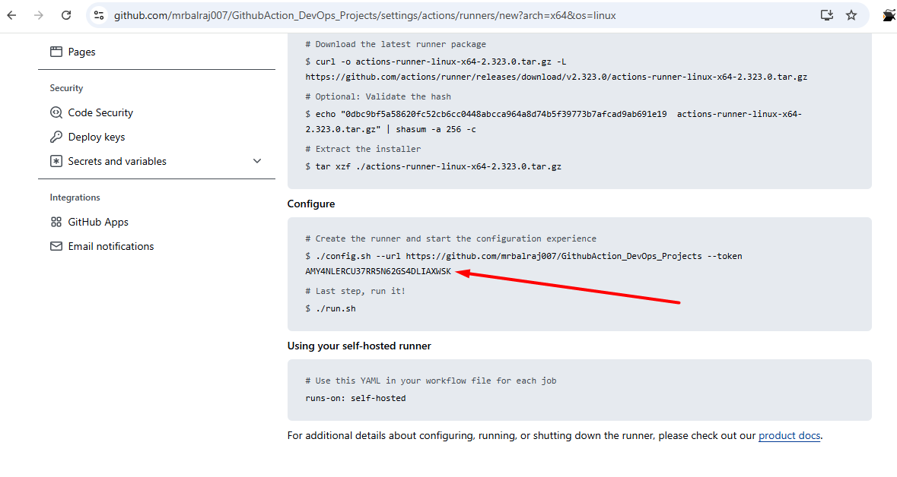
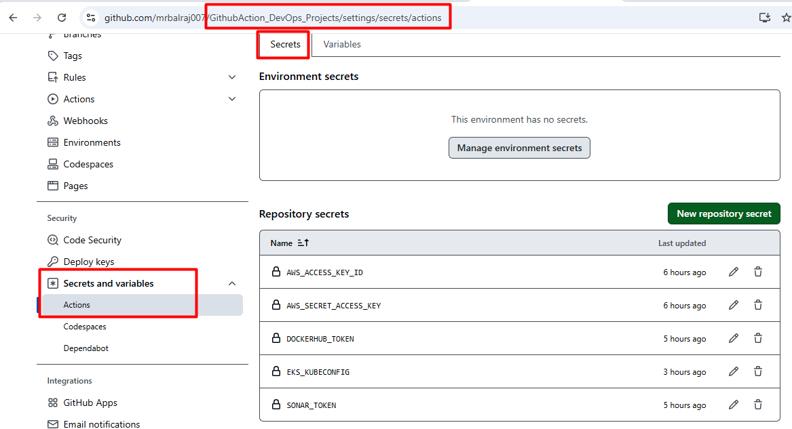
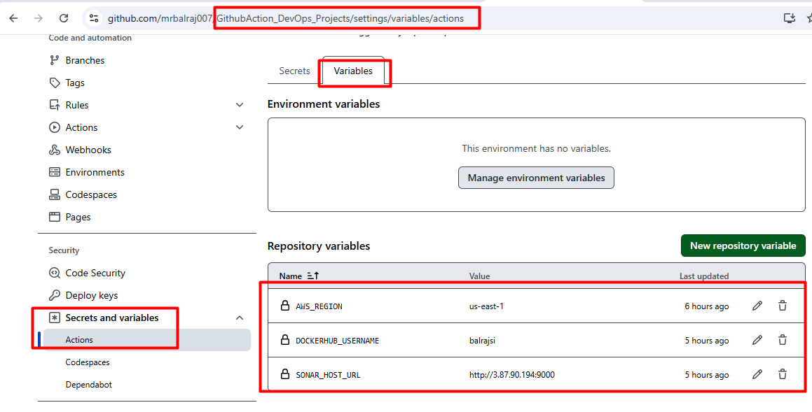
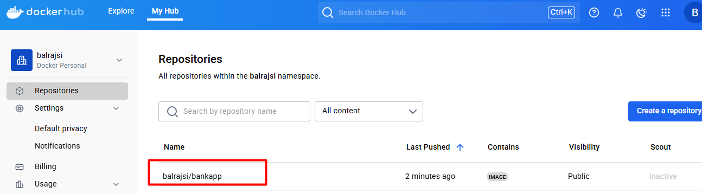
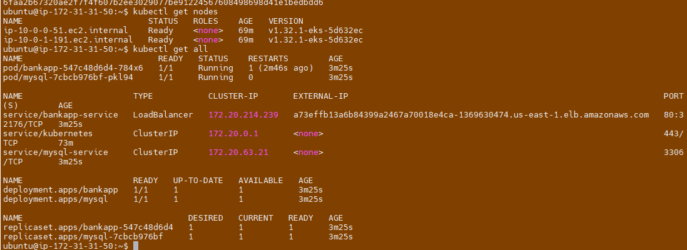
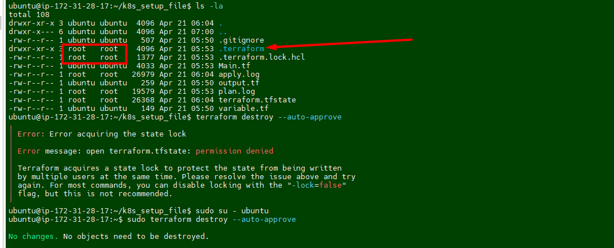

<!-- sudo rm /etc/apt/sources.list.d/trivy.list
✅ Step-by-step Fix:
1. Check for Duplicate Sources
Run this to find duplicate entries:

bash
Copy
Edit
grep -r "aquasecurity.github.io" /etc/apt/sources.list /etc/apt/sources.list.d/
You'll likely see multiple entries for Trivy, possibly with different Signed-By values.

2. Remove the Conflicting Entry/Entries
Remove the Trivy source files causing the conflict:

bash
Copy
Edit
sudo rm /etc/apt/sources.list.d/trivy.list
(Adjust the filename if different based on the output of step 1.)

 that's the root cause right there. You have two conflicting lines in the same file (/etc/apt/sources.list.d/trivy.list):

One line includes signed-by=/usr/share/keyrings/trivy.gpg

The other does not — and that creates the conflict.

🔧 Fix It
You just need to clean up that file and leave only one valid line. Here's how:

Option 1: Clean manually (quick edit)
bash
Copy
Edit
sudo nano /etc/apt/sources.list.d/trivy.list
Change this:

bash
Copy
Edit
deb [signed-by=/usr/share/keyrings/trivy.gpg] https://aquasecurity.github.io/trivy-repo/deb noble main
deb https://aquasecurity.github.io/trivy-repo/deb noble main
To this (just keep one line):

bash
Copy
Edit
deb [signed-by=/usr/share/keyrings/trivy.gpg] https://aquasecurity.github.io/trivy-repo/deb noble main
Then save and exit (Ctrl+O, Enter, Ctrl+X).

Option 2: Or delete the file entirely (if you're removing Trivy anyway)
bash
Copy
Edit
sudo rm /etc/apt/sources.list.d/trivy.list
 -->

---
# Automating EKS Deployment with Terraform and GitHub Actions – The DevOps Way
<!-- 
- Kubernetes Made Easy: Terraform-Powered EKS Provisioning with GitHub Actions CI/CD
- Technical Project project: GitHub Actions CI/CD Pipeline with Live Project
# https://github.com/user-attachments/assets/b93fa528-6778-4c97-94ee-6e36c7f4fa8e
 -->

---

## **Project Overview**
This project outlines the step-by-step process of setting up a CI/CD pipeline using GitHub Actions. The project demonstrates how to automate the build, test, and deployment of an application to Kubernetes using tools like Docker, Trivy, SonarQube, and Terraform. The project also highlights the integration of AWS role for managing cloud resources and Kubernetes clusters.

---
## <span style="color: Yellow;"> Prerequisites </span>
Before diving into this project, here are some skills and tools you should be familiar with:

- Terraform installed on your machine.
- A GitHub account.
- A GitHub personal access token with the necessary permissions to create repositories.

> ⚠️ **Important:** 

> 01. Make sure First you will create a **`.pem`** key manually from the AWS console. i.e "MYLABKEY.pem" because it will be used for creating `EC2` VMs and `EKS cluster`.
> 02. Copy `MYLABKEY.pem` in the terraform directory (`01.Code_IAC_Selfhosted-Runner-and-Trivy` and `03.Code_IAC_Terraform_box` ) as below your terraform code
> 03. [Generate the Github Token](https://docs.github.com/en/authentication/keeping-your-account-and-data-secure/managing-your-personal-access-tokens)
```sh
ls 
\Learning_GitHub_Action\01.Github_Action_DevOps-Project\Terraform_Code_Infra_setup


Mode                 LastWriteTime         Length Name                                                                                                                                                                                              
----                 -------------         ------ ----                                                                                                                                                                                              
dar--l          17/04/25  12:48 PM                .terraform                                                                                                                                                                                        
dar--l          21/04/25  12:34 PM                00.Code_IAC-github-repo                                                                                                                                                                           
dar--l          21/04/25  12:34 PM                01.Code_IAC_Selfhosted-Runner-and-Trivy                                                                                                                                                           
dar--l          21/04/25   1:38 PM                02.Code_IAC_SonarQube                                                                                                                                                                             
dar--l          21/04/25  12:34 PM                03.Code_IAC_Terraform_box                                                                                                                                                                         
-a---l          20/08/24   1:45 PM            493 .gitignore                                                                                                                                                                                                                                                                                                                                    
-a---l          21/04/25   1:59 PM          18225 AboutThis Project.md                                                                                                                                                                              
-a---l          19/04/25   8:48 PM           1309 main.tf                                                                                  
````

- [Clone repository for terraform code](https://github.com/mrbalraj007/Learning_GitHub_Action/tree/main/01.Github_Action_DevOps-Project/Terraform_Code_Infra_setup)<br>
  > 💡 **Note:** Replace GitHub Token, resource names and variables as per your requirement in terraform code
  > - For **`github Repo`** Token value to be updated in file 
      - `00.Code_IAC-github-repo/variables.tf` (i.e default- ```xxxxxx```*)
  > - **For EC2 VM** 
      - `01.Code_IAC_Selfhosted-Runner-and-Trivy/main.tf` (i.e keyname- ```MYLABKEY```*)
      - `03.Code_IAC_Terraform_box/main.tf` (i.e keyname- ```MYLABKEY```*)
  > - For **Cluster name** 
      - `03.Code_IAC_Terraform_box/k8s_setup_file/main.tf` (i.e ```balraj```*).
  > - For **Node Pod**
      - `03.Code_IAC_Terraform_box/k8s_setup_file/variable.tf` (i.e ```MYLABKEY```*)
  
      
- **Set up your GitHub token**:
   - Create a new GitHub personal access token with the `repo` scope at https://github.com/settings/tokens. 
   - Then set it as an environment variable (DO NOT commit your token to version control):
   
   ```bash
   # For Linux/macOS
   export GITHUB_TOKEN=your_github_token
   
   # For Windows Command Prompt
   set GITHUB_TOKEN=your_github_token
   
   # For Windows PowerShell (I used this one)
   # $env:GITHUB_TOKEN="your_github_token"
   $env:TF_VAR_github_token = "your-github-personal-access-token"
   ```
- **Test and verify with curl again in powershell terminal:**
   ```powershell
   $headers = @{
    Authorization = "token $env:TF_VAR_github_token"
   }
   Invoke-WebRequest -Uri "https://api.github.com/user" -Headers $headers
   ```
   - You should see your GitHub user info in JSON, **not** "Bad credentials".
---

## **Key Points**
1. **GitHub Actions Overview**:
   - GitHub Actions is used as the CI/CD tool for this project.
   - It eliminates the need for setting up and maintaining Jenkins servers by providing managed runners.

2. **Pipeline Stages**:
   - **Compile**: Builds the application.
   - **Security Checks**: Scans for vulnerabilities using Trivy and GitLeaks.
   - **Unit Testing**: Executes test cases to ensure code quality.
   - **Build and Publish Docker Image**: Builds a Docker image and uploads it as an artifact.
   - **Deploy to Kubernetes**: Deploys the application to an EKS cluster using Terraform.

3. **Tools and Technologies Used**:
   - **GitHub Actions**: CI/CD automation.
   - **Docker**: Containerization of the application.
   - **Trivy**: Security scanning for vulnerabilities.
   - **GitLeaks**: Detects hardcoded secrets in the source code.
   - **SonarQube**: Code quality analysis.
   - **AWS CLI**: Manages AWS resources.
   - **Terraform**: Infrastructure as Code (IaC) for provisioning EKS clusters.
   - **Kubernetes**: Orchestrates containerized applications.

4. **Why Use This Project**:
   - Automates the software delivery process.
   - Ensures code quality and security through automated checks.
   - Simplifies deployment to Kubernetes clusters.
   - Demonstrates best practices for CI/CD pipelines.

5. **Takeaways**:
   - Understanding of GitHub Actions and its capabilities.
   - Hands-on experience with integrating security tools like Trivy and GitLeaks.
   - Knowledge of deploying applications to Kubernetes using Terraform.
   - Insights into managing AWS resources with AWS CLI.

---

## **Step-by-Step Process**

### <span style="color: Yellow;">Setting Up the Infrastructure </span>

I have created a Terraform code to set up the entire infrastructure, including the installation of required applications, tools, and the EKS cluster automatically created.
- &rArr;<span style="color: brown;"> Docker Install
- &rArr;<span style="color: brown;"> SonarQube Install
- &rArr;<span style="color: brown;"> Trivy Install
- &rArr;<span style="color: brown;"> Terraform Install
- &rArr;<span style="color: brown;"> EKS Cluster Setup

> 💡 **Note:**  &rArr;<span style="color: Green;"> ```EKS cluster``` creation will take approx. 10 to 15 minutes.
> 
#### <span style="color: Yellow;"> To Create EC2 Instances

First, we'll create the necessary virtual machines using ```terraform``` code. 

Below is a terraform Code:

Once you [clone repo](https://github.com/mrbalraj007/Learning_GitHub_Action/blob/main/01.Github_Action_DevOps-Project/Terraform_Code_Infra_setup) then go to folder *<span style="color: cyan;">"01.Github_Action_DevOps-Project/Terraform_Code_Infra_setup"</span>* and run the terraform command.
```bash
cd 01.Github_Action_DevOps-Project/Terraform_Code_Infra_setup

$ ls

 00.Code_IAC-github-repo/   01.Code_IAC_Selfhosted-Runner-and-Trivy/   02.Code_IAC_SonarQube/   03.Code_IAC_Terraform_box/  'AboutThis Project.md'   main.tf   
```

> 💡 **Note:** </span> &rArr; Make sure to run ```main.tf``` which is located outside of the folder. I have created the code in such a way that a single file will call all of the folders.

```bash
 ls -la
total 72
-rw-r--r-- 1 bsingh 1049089   493 Aug 20  2024  .gitignore
drwxr-xr-x 1 bsingh 1049089     0 Apr 21 12:34  00.Code_IAC-github-repo/
drwxr-xr-x 1 bsingh 1049089     0 Apr 21 12:34  01.Code_IAC_Selfhosted-Runner-and-Trivy/
drwxr-xr-x 1 bsingh 1049089     0 Apr 21 13:38  02.Code_IAC_SonarQube/
drwxr-xr-x 1 bsingh 1049089     0 Apr 21 12:34  03.Code_IAC_Terraform_box/
-rw-r--r-- 1 bsingh 1049089 21284 Apr 21 14:44 'AboutThis Project.md'
-rw-r--r-- 1 bsingh 1049089  1309 Apr 19 20:48  main.tf
```
You need to run ```main.tf``` file using following terraform command.

Now, run the following command.
```bash
terraform init
terraform fmt
terraform validate
terraform plan
terraform apply 
# Optional <terraform apply --auto-approve>
```
-------


Once you run the terraform command, then we will verify the following things to make sure everything is setup properly via a terraform.

### <span style="color: Orange;"> Inspect the ```Cloud-Init``` logs</span>: 
Once connected to EC2 instance then you can check the status of the ```user_data``` script by inspecting the [log files](https://github.com/mrbalraj007/Learning_GitHub_Action/blob/main/01.Github_Action_DevOps-Project/Terraform_Code_Infra_setup/03.Code_IAC_Terraform_box/cloud-init-output.log).
```bash
# Primary log file for cloud-init
sudo tail -f /var/log/cloud-init-output.log
                    or 
sudo cat /var/log/cloud-init-output.log | more
```
  > 🔍- *If the user_data script runs successfully, you will see output logs and any errors encountered during execution.*

  > 🔍- *If there’s an error, this log will provide clues about what failed.*

- Verify the Outcome of "```cloud-init-output.log```"

### <span style="color: cyan;"> Verify the Installation 

- [x] <span style="color: brown;"> Docker version
```bash
ubuntu@ip-172-31-95-197:~$ docker --version
Docker version 24.0.7, build 24.0.7-0ubuntu4.1


docker ps -a
ubuntu@ip-172-31-94-25:~$ docker ps
```

- [x] <span style="color: brown;"> trivy version
```bash
ubuntu@ip-172-31-89-97:~$ trivy version
Version: 0.55.2
```
- [x] <span style="color: brown;"> Terraform version
```bash
ubuntu@ip-172-31-89-97:~$ terraform version
Terraform v1.9.6
on linux_amd64
```
- [x] <span style="color: brown;"> eksctl version
```bash
ubuntu@ip-172-31-89-97:~$ eksctl version
0.191.0
```
- [x] <span style="color: brown;"> kubectl version
```bash
ubuntu@ip-172-31-89-97:~$ kubectl version
Client Version: v1.31.1
Kustomize Version: v5.4.2
```
- [x] <span style="color: brown;"> aws cli version
```bash
ubuntu@ip-172-31-89-97:~$ aws version
usage: aws [options] <command> <subcommand> [<subcommand> ...] [parameters]
To see help text, you can run:
  aws help
  aws <command> help
  aws <command> <subcommand> help
```
###  <span style="color: brown;"> Verify the EKS Cluster installation
- Will take a putty session of from Terraform EC2
- On the ```terraform``` virtual machine, Go to directory ```k8s_setup_file``` and open the file ```cat apply.log``` to verify the cluster is created or not.
- Will verify the cluster status from 
   - `sudo cat /var/log/cloud-init-output.log | more` or 
   - `cat /home/ubuntu/k8s_setup_file/apply.log`

   ```sh
   ubuntu@ip-172-31-90-126:~/k8s_setup_file$ pwd
   /home/ubuntu/k8s_setup_file
   ubuntu@ip-172-31-90-126:~/k8s_setup_file$ cd ..
   ```
   

- After Terraform deploys on the instance, now it's time to setup the cluster. If you logout the ssh session then reconnect the SSH and run to following command:

   ```bash
   aws eks update-kubeconfig --name <cluster-name> --region 
   <region>
   ```
- Once EKS cluster is setup then need to run the following command to make it intract with EKS.

   ```sh
   aws eks update-kubeconfig --name balraj-cluster --region us-east-1
   ```
   

> > ⚠️ **Important:** <br>
*The ```aws eks update-kubeconfig``` command is used to configure your local kubectl tool to interact with an Amazon EKS (Elastic Kubernetes Service) cluster. It updates or creates a kubeconfig file that contains the necessary authentication information to allow kubectl to communicate with your specified EKS cluster.*

> > <span style="color: Orange;"> **What happens when you run this command**:</span><br>
The AWS CLI retrieves the required connection information for the EKS cluster (such as the API server endpoint and certificate) and updates the kubeconfig file located at ```~/.kube/config (by default)```.
It configures the authentication details needed to connect kubectl to your EKS cluster using IAM roles.
After running this command, you will be able to interact with your EKS cluster using kubectl commands, such as ```kubectl get nodes``` or ```kubectl get pods```.

   ```sh
   kubectl get nodes
   kubectl cluster-info
   kubectl config get-contexts
   ```


---
### <span style="color: yellow;"> **Verify GitHub Repo and GitHub Actions**
   - Verify GitHub repository created and initialize it because we are using terraform.
      
   - Verify a `.github/workflows` directory created along with two YAML file for the pipeline.
      

### <span style="color: cyan;">**Adding a Virtual Machine as a Runner**
   - I'll be using self-hosted runner to execute all the pipeline.
   - Configure the runner by following the commands provided in GitHub's settings.
      ```
         Go to "GithubAction_DevOps_Projects"
         Click on settings
         then select the actions and choose "runners"
      ```
   
   - Click on new `self-hosted runner` and select `Linux`
   - Notedown the token value somewhere as we need to in runner VM.
   
   - Take putty session of `runner` EC2
   - Go to `actions-runner` folder
      
   - Update/Paste the token value here as mentioned in screenshot.
      
   - Change the execution mode for script and run it.
   - `chmod +x selfhost-runner.sh`

> 💡 **Note:** 
> >*Take note of the token value from here and paste it into the script in runner at the following spot. This ensures that the script executes successfully with the necessary permissions. Once you've finished, save your modifications and run the script to test whether it works as planned.*

#### **Troubleshooting:** 
- I am getting below error message while execute the file.


##### **Fix/Solution:**
 - I try explicitly invoking the bash interpreter:
   ```Bash
   bash ./selfhost-runner.sh
   ```
- The solution is to remove these carriage return characters using the dos2unix command:
   1. Install dos2unix if you haven't already:
   ```Bash
   sudo apt-get update
   sudo apt-get install dos2unix
   ```
   2. Run `dos2unix` on `selfhost-runner.sh` script:
   ```Bash
   dos2unix selfhost-runner.sh
   ```
   3. Try running the script again:
   ```Bash
   ./selfhost-runner.sh
   ```
> 💡 **Idea:** This should now execute correctly because the problematic carriage return characters will have been removed

It works :-) and I am able to execute the file.


### <span style="color: yellow;"> Setup SonarQube </span>
- Go to SonarQube EC2 and notedown the Public IPAddress and open a new browser.
- Access SonarQube via ```http://<your-server-ip>:9000```.


> 💡 **Note:** *When you access the above URl then it will be promot for login. Use the "`admin/admin`" for first time login and will prompt for change the password Once you change the password, make sure to create a strong and secure one that you can remember. Afterward, you will have full access to the system's features and settings.*

####  <span style="color: cyan;"> Create a token in SonarQube
  - Go to `Administration`>`Security`>`Users`>Create a new token
  


###  <span style="color: yellow;"> Configure Secrets and Variables in GitHub Repo</span>.
```
Go to Repo `GithubAction_DevOps_Projects`
Click on `settings`
Click on `Secrets and Variables`
Select `Actions`.
```


> 💡 **Note:** 
> >*You have to update all the required tokens and secrets value here. Part of Terraform code, I have already created a dummy values, which needs to be replaced. Once you have replaced the dummy values with the actual tokens and secrets, ensure that you test the configuration thoroughly to confirm that everything functions as expected. This will help prevent any issues during deployment and maintain the integrity of your infrastructure.*

- **To Update Sonar URL** 


- **To update the `EKS_KUBECONFIG` secret**
  - Take putty session of Terraform EC2 instnace
  - run the command `cat ~/.kube/config`
  - copy the whole content and paste into the secret.

### **Attach Role to Runner EC2**
   - Select the EC2 VM and click on the `actions` > `security`>` Mofify IAM Roles on the runner`.
   
   - Select the role `Role_k8_Cluster_profile` 
   
   - Click on update IAM Role.

### <span style="color: orange;">  **Writing the CI/CD Pipeline**
   - **Compile Stage**:
     - Use `actions/checkout` to clone the repository.
     - Set up the required environment (e.g., JDK 17 for Java projects).
     - Compile the application using build tools like Maven.
   - **Security Checks**:
     - Install and run Trivy to scan for vulnerabilities in Docker images.
     - Use GitLeaks to detect hardcoded secrets in the source code.
   - **Unit Testing**:
     - Execute test cases to validate the application.
   - **Build and Publish Docker Image**:
     - Build a Docker image using `docker build`.
     - Push the image to a container registry or upload it as an artifact.
   - **Deploy to Kubernetes**:
     - Use Terraform to provision an EKS cluster.
     - Deploy the application using Kubernetes manifests.


- Here is the complete [CICD- Pipeline details](https://github.com/mrbalraj007/Github-Actions-Project/blob/main/.github/workflows/cicd.yml)

<!-- **6. Deploying to Kubernetes**
   - Use `kubectl` to apply Kubernetes manifests.
   - Verify the deployment by checking the status of pods and services. -->

### Verify the Docker Image
   
### Verify code coverage in SonarQube
   
   
### Verify pipeline Status
   


### Verify the pods in runner VM
   
   
### Verify Application Status
   
---

## <span style="color: Yellow;"> Environment Cleanup:
- Following resouces are created as pert of this project.   
   

### <span style="color: cyan;"> To delete deployment:
- I've created a `Github Action` to destroy the Kubernetes `deployment` and `services`.
   

  - __Delete all deployment/Service__: 
    - In github action, and click on the second pipeline to delete the deployment and service.
   
   

    - Here is the complete [CICD- Pipeline to destroy Deployment and Services](https://github.com/mrbalraj007/Github-Actions-Project/blob/main/.github/workflows/Destroy.yaml)

### <span style="color: cyan;"> To delete ```AWS EKS cluster```
   -   Login into the `Terraform EC2 `instance and change the directory to /`k8s_setup_file`, and run the following command to delete the cluster.
       - ```sh
         sudo su - ubuntu
         cd /k8s_setup_file
         sudo terraform destroy --auto-approve
         ```
#### **Troubleshooting:** 
- I am getting below error message while running the `Terraform destroy`.
   


##### **Fix/Solution:**

- I noticed that permission is set to root for terraform dirctory. we have to take ownership first and then try to delete it.

- Run the following command to take ownership
   ```sh
   sudo chown -R ubuntu:ubuntu /home/ubuntu/k8s_setup_file/.terraform*
   ```
- I was still getting error message while runing the desrtoy
   
- I ran the following command again for entire terraform folder.
   ```sh
   sudo chown -R ubuntu:ubuntu /home/ubuntu/k8s_setup_file/terraform*
   ```
- Rerun the destroy command and this time it works :-)


###  <span style="color: cyan;"> To delete the ```Virtual machine```.
Go to folder *<span style="color: cyan;">"01.Github_Action_DevOps-Project/Terraform_Code_Infra_setup"</span>* and run the terraform command.
   - `00.Code_IAC-github-repo`
   - `01.Code_IAC_Selfhosted-Runner-and-Trivy`
   -` 02.Code_IAC_SonarQube`
   - `03.Code_IAC_Terraform_box`
      
      ```sh
      Terraform destroy --auto-approve
     ```
> 💡 **Note:** 
>> You must use this command from `each folder` in order to destroy the entire infrastructure.
---

### **Why Use This Project**
- **Automation**: Reduces manual effort in building, testing, and deploying applications.
- **Security**: Ensures code and container security through automated scans.
- **Scalability**: Deploys applications to scalable Kubernetes clusters.
- **Best Practices**: Demonstrates industry-standard CI/CD practices.

---

### **Conclusion**
This project provides a comprehensive guide to setting up a CI/CD pipeline using GitHub Actions. By integrating tools like Docker, Trivy, SonarQube, and Terraform, it ensures a secure and efficient software delivery process. The use of AWS CLI and Kubernetes further demonstrates the deployment of applications to cloud-native environments. This project is a valuable resource for DevOps engineers looking to implement modern CI/CD pipelines.


__Ref Link:__

- [Youtube VideoLink](https://www.youtube.com/watch?v=icZUzgtz_d8)
- [Clearfile-content cache in visualstudio code](https://stackoverflow.com/questions/45216264/clear-file-content-cache-in-visual-studio-code)
- [managing-GitHub-access-tokens](https://docs.github.com/en/authentication/keeping-your-account-and-data-secure/managing-your-personal-access-tokens)
- [GitHub Actions Markget Place](https://github.com/marketplace)
- [download-a-build-artifact](https://github.com/marketplace/actions/download-a-build-artifact)
- [upload-a-build-artifact](https://github.com/marketplace/actions/upload-a-build-artifact)
