# Corporate DevOps Pipeline Implementation: GitHub Actions to Kubernetes

## Executive Summary

This project outlines a comprehensive end-to-end DevOps pipeline implementation reflecting real-world corporate workflows. The project demonstrates how to build a complete CI/CD pipeline using GitHub Actions, integrating code quality checks, container management, Kubernetes deployment, and monitoring solutions. The implementation follows industry best practices and provides a blueprint for modern application delivery workflows.

## Tools & Technologies Used

### Core Components:
   - **GitHub Actions**: CI/CD pipeline orchestration
   - **Self-hosted Runner**: Custom VM for pipeline execution
   - **Kubernetes**: Self-managed cluster for application deployment
   - **Docker**: Application containerization
   - **SonarQube**: Code quality and security analysis
   - **Trivy**: Container and filesystem vulnerability scanning
   - **GitLeaks**: Detects hardcoded secrets in the source code.
   - **AWS CLI**: Manages AWS resources.
   - **Terraform**: Infrastructure as Code (IaC) for provisioning EKS clusters.
 
### Monitoring Stack:
- **Prometheus**: Metrics collection and storage
- **Grafana**: Visualization and dashboarding
- **Blackbox Exporter**: External HTTP endpoint monitoring
- **Node Exporter**: System-level metrics collection

### Infrastructure:
- **AWS EC2**: Virtual machine hosting
- **Ubuntu 24.04**: Base operating system

## Project Architecture

```
Client Request → JIRA Ticket → Developer Implementation → GitHub Repository
     ↓
GitHub Actions Pipeline (Self-hosted Runner)
[Code Checkout → Build → Test → SonarQube Analysis → Artifact Creation → 
 Docker Build → Trivy Scan → DockerHub Push → K8s Deployment]
     ↓
Kubernetes Cluster (Master/Worker) → Application Deployment
     ↓
Prometheus/Grafana Monitoring
```

## Implementation Steps

### 1. Infrastructure Setup

#### 1.1 Kubernetes Cluster Configuration
- Created master and worker nodes on AWS EC2 (t2.medium, 4GB RAM)
- Configured security groups with required ports (22, 80, 443, 3000-10000)
- Automated cluster setup using shell scripts for repeatability

#### 1.2 Self-hosted GitHub Actions Runner
- Provisioned dedicated EC2 instance (8GB RAM)
- Registered with GitHub repository using authentication token
- Configured with necessary tools (Maven, Docker, Trivy)

#### 1.3 SonarQube Server
- Deployed as Docker container on Runner instance
- Exposed on port 9000 for pipeline integration
- Created authentication token for secure pipeline access

### 2. Pipeline Implementation

#### 2.1 GitHub Actions Workflow
- Created `.github/workflows` directory with pipeline definition
- Configured triggers based on push events to main branch
- Implemented job separation with proper dependency management

#### 2.2 Build and Quality Gates
- Java application compilation with Maven
- Unit testing with automated reporting
- SonarQube analysis with quality gate enforcement
- Artifact generation and publication to GitHub

#### 2.3 Container Management
- Docker image creation from application artifact
- Vulnerability scanning with Trivy
- Secure DockerHub authentication and image pushing

#### 2.4 Kubernetes Deployment
- RBAC setup with service accounts and role bindings
- Secret management for secure cluster authentication
- Deployment manifests with proper resource management
- Service exposure via LoadBalancer (cloud-ready)

### 3. Monitoring Implementation

#### 3.1 Prometheus Setup
- Deployed Prometheus server for metrics collection
- Configured scrape intervals and retention policies
- Integrated with exporters for comprehensive monitoring

#### 3.2 Application Monitoring
- Blackbox Exporter configuration for HTTP endpoint monitoring
- Probe setup for response time and availability tracking
- Dashboard creation for application health visualization

#### 3.3 System Monitoring
```markdown
// ...existing code...

## Node Exporter Configuration for System Monitoring

The Node Exporter implementation provides critical system-level metrics for the Runner VM:

1. **Installation Process**:
   - Downloaded Node Exporter package from prometheus.io
   - Extracted and renamed for better organization
   - Executed as background process on port 9100

2. **Prometheus Integration**:
   - Added Node Exporter target to Prometheus configuration
   - Configured appropriate scrape interval
   - Verified successful connection in Prometheus targets dashboard

3. **Grafana Dashboard**:
   - Imported specialized Node Exporter dashboard
   - Configured metrics for CPU, memory, disk, and network monitoring
   - Set up automatic refresh intervals for real-time visibility

This system-level monitoring complements the application monitoring provided by Blackbox Exporter, giving complete visibility across the infrastructure and application stack.

## Project Challenges

### Technical Complexity
```

## Project Challenges

### Technical Complexity
   - Coordinating multiple tools and technologies in a cohesive pipeline
   - Ensuring proper authentication between services (GitHub, Docker Hub, Kubernetes)
   - Managing Kubernetes RBAC for secure but sufficient permissions
   - Configuring Prometheus targets with proper scraping intervals

### Integration Points
   - Bridging self-hosted runner with GitHub Actions ecosystem
   - Connecting pipeline stages with appropriate artifact handoffs
   - Ensuring monitoring tools receive metrics from all components
   - Managing secrets securely across multiple services

### Infrastructure Management
   - Provisioning right-sized VMs for each component
   - Configuring network security for appropriate access
   - Ensuring high availability for critical components
   - Managing resource consumption across the stack

## Project Benefits

### Development Workflow
   - Automated quality gates prevent problematic code from reaching production
   - Developers receive immediate feedback on code quality and security
   - Clear visibility of deployment status and application health
   - Reduced manual intervention in deployment processes

### Operational Excellence
   - Real-time monitoring of application and infrastructure
   - Early detection of performance degradation or failures
   - Ability to correlate infrastructure metrics with application behavior
   - Historical metrics for capacity planning and optimization

### Security Enhancements
   - Vulnerability scanning at multiple levels (code, container)
   - Principle of least privilege through RBAC implementation
   - Secure secret management across the pipeline
   - Audit trail of deployments and changes

### Business Value
   - Faster time-to-market for new features and bug fixes
   - Improved application reliability and performance
   - Reduced operational overhead through automation
   - Better resource utilization through monitoring insights

---
## <span style="color: Yellow;"> Prerequisites </span>
Before diving into this project, here are some skills and tools you should be familiar with:

- Terraform installed on your machine.
- A GitHub account.
- A GitHub personal access token with the necessary permissions to create repositories.

> ⚠️ **Important:** 

> 01. Make sure First you will create a **`.pem`** key manually from the AWS console. i.e "MYLABKEY.pem" because it will be used for creating `EC2` VMs and `EKS cluster`.
> 02. Copy `MYLABKEY.pem` in the terraform directory (`01.Code_IAC_Selfhosted-Runner-and-Trivy` and `03.Code_IAC_Terraform_box` ) as below your terraform code
> 03. [Generate the Github Token](https://docs.github.com/en/authentication/keeping-your-account-and-data-secure/managing-your-personal-access-tokens)
```sh
ls 
\Learning_GitHub_Action\01.Github_Action_DevOps-Project\Terraform_Code_Infra_setup


Mode                 LastWriteTime         Length Name                                                                                                                                                                                              
----                 -------------         ------ ----                                                                                                                                                                                              
dar--l          17/04/25  12:48 PM                .terraform                                                                                                                                                                                        
dar--l          21/04/25  12:34 PM                00.Code_IAC-github-repo                                                                                                                                                                           
dar--l          21/04/25  12:34 PM                01.Code_IAC_Selfhosted-Runner-and-Trivy                                                                                                                                                           
dar--l          21/04/25   1:38 PM                02.Code_IAC_SonarQube                                                                                                                                                                             
dar--l          21/04/25  12:34 PM                03.Code_IAC_Terraform_box                                                                                                                                                                         
-a---l          20/08/24   1:45 PM            493 .gitignore                                                                                                                                                                                                                                                                                                                                    
-a---l          21/04/25   1:59 PM          18225 AboutThis Project.md                                                                                                                                                                              
-a---l          19/04/25   8:48 PM           1309 main.tf # <---(This one need to run)                                                                                 
````

- [Clone repository for terraform code](https://github.com/mrbalraj007/Learning_GitHub_Action/tree/main/02.Github_Action_DevOps-Project/Terraform_Code_Infra_setup)<br>
  > 💡 **Note:** Replace GitHub Token, resource names and variables as per your requirement in terraform code
  > - For **`github Repo`** Token value to be updated in file 
      - `00.Code_IAC-github-repo/variables.tf` (i.e default- `xxxxxx`*)
  > - **For EC2 VM** 
      - `01.Code_IAC_Selfhosted-Runner-and-Trivy/terraform.tfvars` (i.e keyname- `MYLABKEY`*)
      - `03.Code_IAC_Terraform_box/terraform.tfvars` (i.e keyname- `MYLABKEY`*)
  > - For **Cluster name** 
      - `03.Code_IAC_Terraform_box/k8s_setup_file/main.tf` (i.e `balraj`*).
  > - For **Node Pod**
      - `03.Code_IAC_Terraform_box/k8s_setup_file/variable.tf` (i.e `MYLABKEY`*)
  
      
- **Set up your GitHub token**:
   - Create a new GitHub personal access token with the `repo` scope at https://github.com/settings/tokens. 
   - Then set it as an environment variable (DO NOT commit your token to version control):
   
   ```bash
   # For Linux/macOS
   export GITHUB_TOKEN=your_github_token
   
   # For Windows Command Prompt
   set GITHUB_TOKEN=your_github_token
   
   # For Windows PowerShell (I used this one)
   # $env:GITHUB_TOKEN="your_github_token"
   $env:TF_VAR_github_token = "your-github-personal-access-token"
   ```
- **Test and verify with curl again in powershell terminal:**
   ```powershell
   $headers = @{
    Authorization = "token $env:TF_VAR_github_token"
   }
   Invoke-WebRequest -Uri "https://api.github.com/user" -Headers $headers
   ```
   - You should see your GitHub user info in JSON, **not** "Bad credentials".
---

## **Key Points**
1. **GitHub Actions Overview**:
   - GitHub Actions is used as the CI/CD tool for this project.
   - It eliminates the need for setting up and maintaining Jenkins servers by providing managed runners.

2. **Pipeline Stages**:
   - **Compile**: Builds the application.
   - **Security Checks**: Scans for vulnerabilities using Trivy and GitLeaks.
   - **Unit Testing**: Executes test cases to ensure code quality.
   - **Build and Publish Docker Image**: Builds a Docker image and uploads it as an artifact.
   - **Deploy to Kubernetes**: Deploys the application to an EKS cluster using Terraform.

3. **Tools and Technologies Used**:
  

4. **Why Use This Project**:
   - Automates the software delivery process.
   - Ensures code quality and security through automated checks.
   - Simplifies deployment to Kubernetes clusters.
   - Demonstrates best practices for CI/CD pipelines.

5. **Takeaways**:
   - Understanding of GitHub Actions and its capabilities.
   - Hands-on experience with integrating security tools like Trivy and GitLeaks.
   - Knowledge of deploying applications to Kubernetes using Terraform.
   - Insights into managing AWS resources with AWS CLI.

---

## **Step-by-Step Process**

### <span style="color: Yellow;">Setting Up the Infrastructure </span>

I have created a Terraform code to set up the entire infrastructure, including the installation of required `Repo`, `SonarQube Scanner`, monitoring tools like `grafana and prometheus`, `argocd` and `EKS cluster` automatically created.

- &rArr;<span style="color: brown;"> Docker Install
- &rArr;<span style="color: brown;"> SonarQube Install
- &rArr;<span style="color: brown;"> Trivy Install
- &rArr;<span style="color: brown;"> Terraform Install
- &rArr;<span style="color: brown;"> EKS Cluster Setup

> 💡 **Note:**  &rArr;<span style="color: Green;"> `**EKS cluster**` creation will take approx. 15 to 20 minutes.
> 
#### <span style="color: Yellow;"> To Create EC2 Instances

First, we'll create the necessary virtual machines using `terraform` code. 

Below is a terraform Code:

Once you [clone repo](https://github.com/mrbalraj007/Learning_GitHub_Action/blob/main/02.Github_Action_DevOps-Project/Terraform_Code_Infra_setup) then go to folder *<span style="color: cyan;">"02.Github_Action_DevOps-Project/Terraform_Code_Infra_setup"</span>* and run the terraform command.
```bash
cd 01.Github_Action_DevOps-Project/Terraform_Code_Infra_setup

$ ls

 00.Code_IAC-github-repo/   01.Code_IAC_Selfhosted-Runner-and-Trivy/   02.Code_IAC_SonarQube/   03.Code_IAC_Terraform_box/  'AboutThis Project.md'   main.tf   
```

> 💡 **Note:** </span> &rArr; Make sure to run `main.tf` which is located outside of the folder. I have created the code in such a way that a single file will call all of the folders.

```bash
 ls -la
total 72
-rw-r--r-- 1 bsingh 1049089   493 Aug 20  2024  .gitignore
drwxr-xr-x 1 bsingh 1049089     0 Apr 21 12:34  00.Code_IAC-github-repo/
drwxr-xr-x 1 bsingh 1049089     0 Apr 21 12:34  01.Code_IAC_Selfhosted-Runner-and-Trivy/
drwxr-xr-x 1 bsingh 1049089     0 Apr 21 13:38  02.Code_IAC_SonarQube/
drwxr-xr-x 1 bsingh 1049089     0 Apr 21 12:34  03.Code_IAC_Terraform_box/
-rw-r--r-- 1 bsingh 1049089 21284 Apr 21 14:44 'AboutThis Project.md'
-rw-r--r-- 1 bsingh 1049089  1309 Apr 19 20:48  main.tf # <---This need to be run>
```
You need to run ```main.tf``` file using following terraform command.

Now, run the following command.
```bash
terraform init
terraform fmt
terraform validate
terraform plan
terraform apply 
# Optional <terraform apply --auto-approve>
```
-------
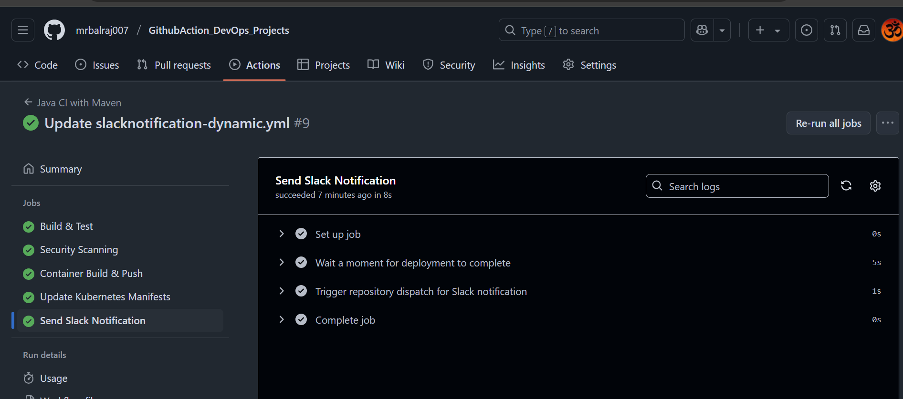

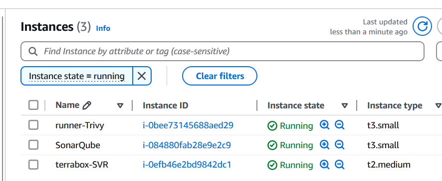

Once you run the terraform command, then we will verify the following things to make sure everything is setup properly via a terraform.

### <span style="color: Orange;"> Inspect the `Cloud-Init` logs</span>: 
Once connected to EC2 instance then you can check the status of the `user_data` script by inspecting the [log files](https://github.com/mrbalraj007/Learning_GitHub_Action/blob/main/01.Github_Action_DevOps-Project/Terraform_Code_Infra_setup/03.Code_IAC_Terraform_box/cloud-init-output.log).
```bash
# Primary log file for cloud-init
sudo tail -f /var/log/cloud-init-output.log
                    or 
sudo cat /var/log/cloud-init-output.log | more
```
  > 🔍- *If the user_data script runs successfully, you will see output logs and any errors encountered during execution.*

  > 🔍- *If there’s an error, this log will provide clues about what failed.*

- Verify the Outcome of "`cloud-init-output.log`"

### <span style="color: cyan;"> Verify the Installation on EC `Terrabox-SVR`

- [x] <span style="color: brown;"> Docker version
```bash
ubuntu@ip-172-31-95-197:~$ docker --version
Docker version 24.0.7, build 24.0.7-0ubuntu4.1


docker ps -a
ubuntu@ip-172-31-94-25:~$ docker ps
```

- [x] <span style="color: brown;"> trivy version
```bash
ubuntu@ip-172-31-89-97:~$ trivy version
Version: 0.55.2
```
- [x] <span style="color: brown;"> Terraform version
```bash
ubuntu@ip-172-31-89-97:~$ terraform version
Terraform v1.9.6
on linux_amd64
```
- [x] <span style="color: brown;"> eksctl version
```bash
ubuntu@ip-172-31-89-97:~$ eksctl version
0.191.0
```
- [x] <span style="color: brown;"> kubectl version
```bash
ubuntu@ip-172-31-89-97:~$ kubectl version
Client Version: v1.31.1
Kustomize Version: v5.4.2
```
- [x] <span style="color: brown;"> aws cli version
```bash
ubuntu@ip-172-31-89-97:~$ aws version
usage: aws [options] <command> <subcommand> [<subcommand> ...] [parameters]
To see help text, you can run:
  aws help
  aws <command> help
  aws <command> <subcommand> help
```
###  <span style="color: brown;"> Verify the EKS Cluster installation
- Will take a putty session of from `Terraform EC2`
- On the `terraform` virtual machine, Go to directory `k8s_setup_file` and open the file `cat apply.log` to verify the cluster is created or not.
- Will verify the cluster status from 
   - `sudo cat /var/log/cloud-init-output.log | more` or 
   - `cat /home/ubuntu/k8s_setup_file/apply.log`
      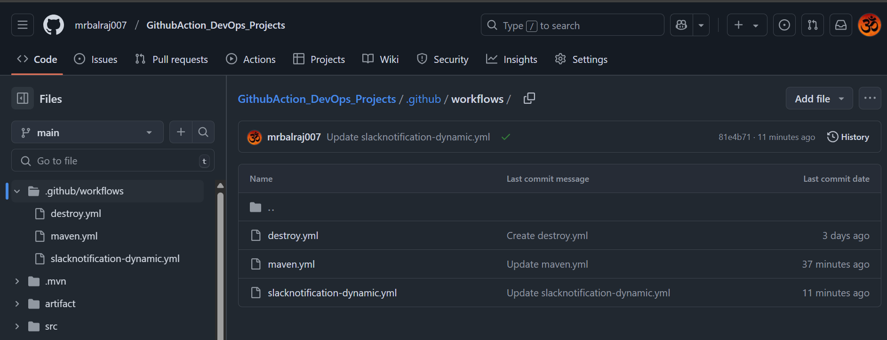
   ```sh
   ubuntu@ip-172-31-90-126:~/k8s_setup_file$ pwd
   /home/ubuntu/k8s_setup_file
   ubuntu@ip-172-31-90-126:~/k8s_setup_file$ cd ..
   ```
  ```sh
  kubectl get nodes
  ``` 
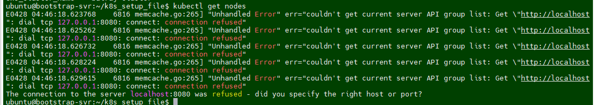

- After Terraform deploys on the instance, now it's time to setup the cluster. If you logout the ssh session then reconnect the SSH and run to following command:

   ```bash
   eksctl utils write-kubeconfig --cluster="$CLUSTER_NAME" --region="$REGION"
   ```
- Once EKS cluster is setup then need to run the following command to make it intract with EKS.

   ```sh
   eksctl utils write-kubeconfig --cluster="balraj-cluster" --region="us-east-1"
   ```
   

> > ⚠️ **Important:** <br>
*The ```aws eks update-kubeconfig``` command is used to configure your local kubectl tool to interact with an Amazon EKS (Elastic Kubernetes Service) cluster. It updates or creates a kubeconfig file that contains the necessary authentication information to allow kubectl to communicate with your specified EKS cluster.*

> > <span style="color: Orange;"> **What happens when you run this command**:</span><br>
The AWS CLI retrieves the required connection information for the EKS cluster (such as the API server endpoint and certificate) and updates the kubeconfig file located at ```~/.kube/config (by default)```.
It configures the authentication details needed to connect kubectl to your EKS cluster using IAM roles.
After running this command, you will be able to interact with your EKS cluster using kubectl commands, such as ```kubectl get nodes``` or ```kubectl get pods```.

   ```sh
   kubectl get nodes
   kubectl cluster-info
   kubectl config get-contexts
   ```
   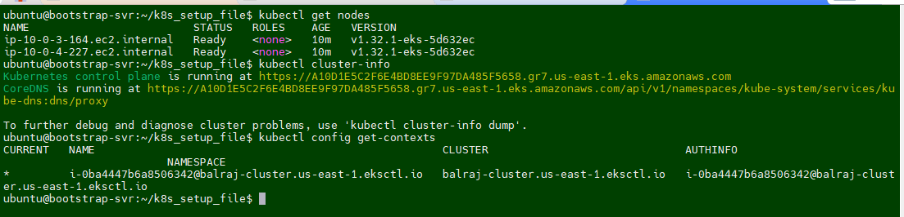

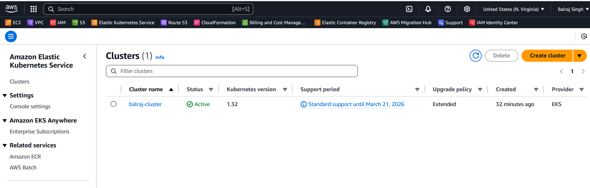


---
### <span style="color: yellow;"> **Verify GitHub Repo and GitHub Actions**
   - Verify GitHub repository created and initialize it because we are using terraform.
      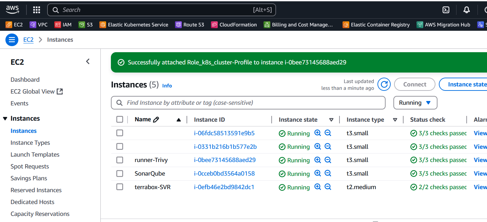
   - Verify a `.github/workflows` directory created along with two YAML file for the pipeline.
      

### <span style="color: cyan;">**Adding a Virtual Machine as a Runner**
   - I'll be using self-hosted runner to execute all the pipeline.
   - Configure the runner by following the commands provided in GitHub's settings.
      ```
         Go to "GithubAction_DevOps_Projects"
         Click on settings
         then select the actions and choose "runners"
      ```
   
   - Click on new `self-hosted runner` and select `Linux`
   - Notedown the token value somewhere as we need to in runner VM.
   
   - Take putty session of `runner` EC2
   - Go to `actions-runner` folder
      
   - Update/Paste the token value here as mentioned in screenshot.
      
   - Change the execution mode for script and run it.
   - `chmod +x selfhost-runner.sh`

> 💡 **Note:** 
> >*Take note of the token value from here and paste it into the script in runner at the following spot. This ensures that the script executes successfully with the necessary permissions. Once you've finished, save your modifications and run the script to test whether it works as planned.*

#### **Troubleshooting:** 
- I am getting below error message while execute the file.


##### **Fix/Solution:**
 - I try explicitly invoking the bash interpreter:
   ```Bash
   bash ./selfhost-runner.sh
   ```
- The solution is to remove these carriage return characters using the dos2unix command:
   1. Install dos2unix if you haven't already:
   ```Bash
   sudo apt-get update
   sudo apt-get install dos2unix
   ```
   2. Run `dos2unix` on `selfhost-runner.sh` script:
   ```Bash
   dos2unix selfhost-runner.sh
   ```
   3. Try running the script again:
   ```Bash
   ./selfhost-runner.sh
   ```
> 💡 **Idea:** This should now execute correctly because the problematic carriage return characters will have been removed

It works :-) and I am able to execute the file.
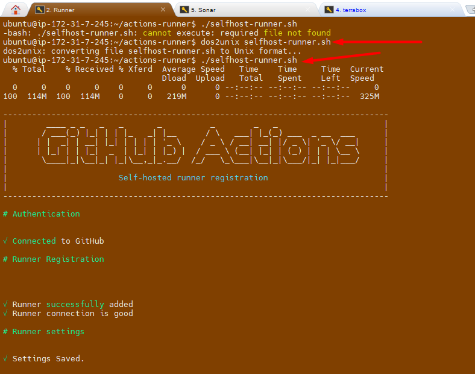
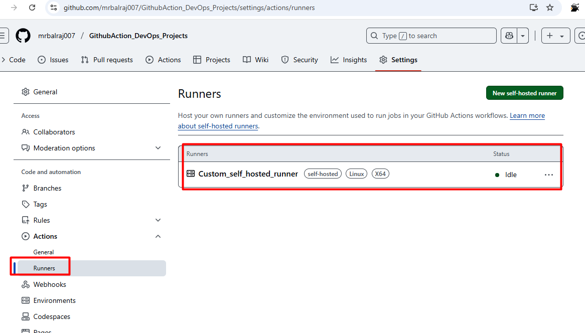


### <span style="color: yellow;"> Setup SonarQube </span>
- Go to SonarQube EC2 and notedown the Public IPAddress and open a new browser.
- Access SonarQube via ```http://<your-server-ip>:9000```.
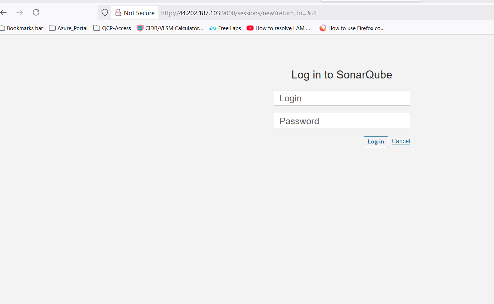

> 💡 **Note:** *When you access the above URl then it will be promot for login. Use the "`admin/admin`" for first time login and will prompt for change the password Once you change the password, make sure to create a strong and secure one that you can remember. Afterward, you will have full access to the system's features and settings.*

####  <span style="color: cyan;"> Create a token in SonarQube
  - Go to `Administration`>`Security`>`Users`>Create a new token
  


###  <span style="color: yellow;"> Configure Secrets and Variables in GitHub Repo</span>.
```
Go to Repo `GithubAction_DevOps_Projects`
            Click on `settings` > `Secrets and Variables` > Select `Actions`.
```
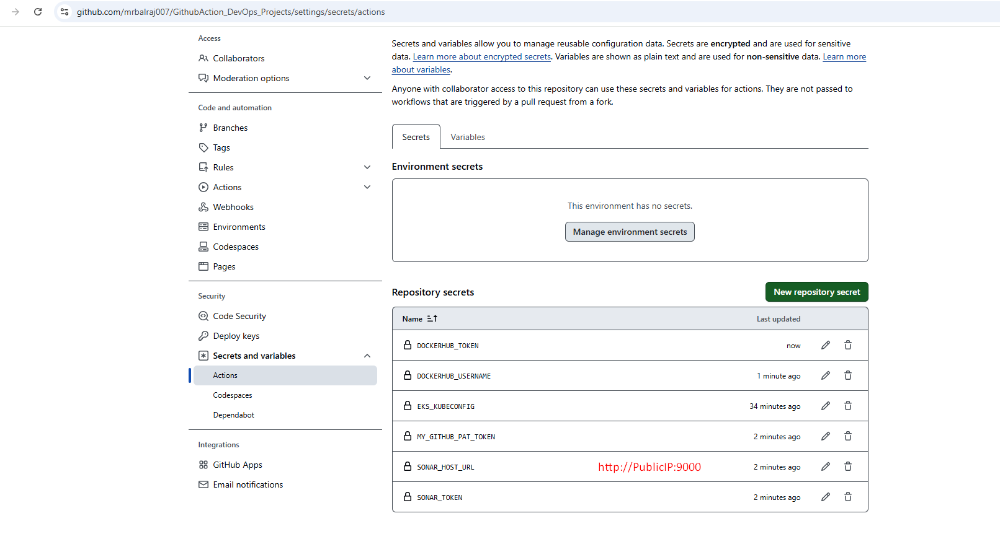

> 💡 **Note:** 
> >*You have to update all the required tokens and secrets value here. Part of Terraform code, I have already created a dummy values, which needs to be replaced. Once you have replaced the dummy values with the actual tokens and secrets, ensure that you test the configuration thoroughly to confirm that everything functions as expected. This will help prevent any issues during deployment and maintain the integrity of your infrastructure.*

- **To update the `EKS_KUBECONFIG` secret**
  - Take putty session of `Terraform EC2` instnace
  - run the command `cat ~/.kube/config`
  - copy the whole content and paste into the secret.
   

### **Attach Role to Runner EC2**
   - Select the EC2 VM and click on the `actions` > `security`>` Mofify IAM Roles on the runner`.
   
   - Select the role `Role_k8_Cluster_profile` 
   
   - Click on update IAM Role.

### <span style="color: orange;">  **Writing the CI/CD Pipeline**
   - **Compile Stage**:
     - Use `actions/checkout` to clone the repository.
     - Set up the required environment (e.g., JDK 17 for Java projects).
     - Compile the application using build tools like Maven.
   - **Security Checks**:
     - Install and run Trivy to scan for vulnerabilities in Docker images.
     - Use GitLeaks to detect hardcoded secrets in the source code.
   - **Unit Testing**:
     - Execute test cases to validate the application.
   - **Build and Publish Docker Image**:
     - Build a Docker image using `docker build`.
     - Push the image to a container registry or upload it as an artifact.
   - **Deploy to Kubernetes**:
     - Use Terraform to provision an EKS cluster.
     - Deploy the application using Kubernetes manifests.


- Here is the complete [CICD- Pipeline details](https://github.com/mrbalraj007/Github-Actions-Project/blob/main/.github/workflows/cicd.yml)

<!-- **6. Deploying to Kubernetes**
   - Use `kubectl` to apply Kubernetes manifests.
   - Verify the deployment by checking the status of pods and services. -->

### Verify the Docker Image
   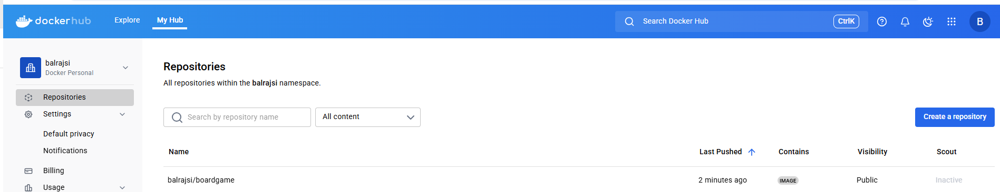
   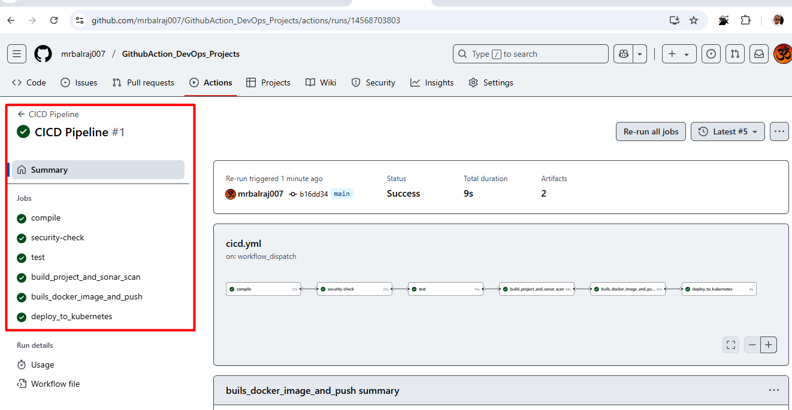
### Verify code coverage in SonarQube
   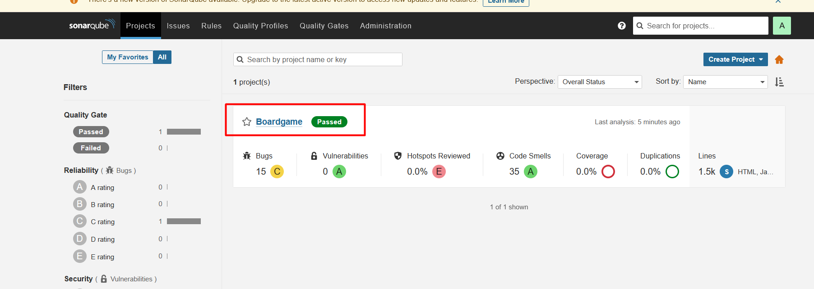
   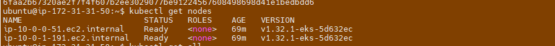
### Verify pipeline Status
   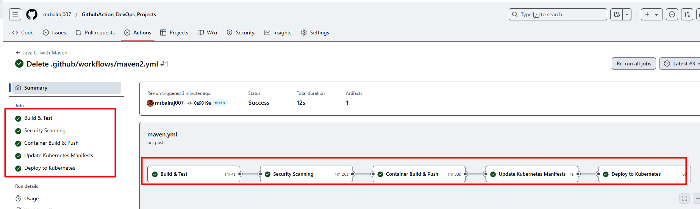


### Verify the pods status from `runner VM`
```bash
ubuntu@ip-172-31-5-61:~$ kubectl get nodes
NAME                         STATUS   ROLES    AGE   VERSION
ip-10-0-3-164.ec2.internal   Ready    <none>   57m   v1.32.1-eks-5d632ec
ip-10-0-4-227.ec2.internal   Ready    <none>   58m   v1.32.1-eks-5d632ec
ubuntu@ip-172-31-5-61:~$ kubectl get all
NAME                                       READY   STATUS    RESTARTS   AGE
pod/boardgame-deployment-99f486879-q6twl   1/1     Running   0          27m
pod/boardgame-deployment-99f486879-wnkqj   1/1     Running   0          27m

NAME                     TYPE           CLUSTER-IP       EXTERNAL-IP                                                              PORT(S)        AGE
service/boardgame-ssvc   LoadBalancer   172.20.232.244   ab89f017a0d0c415a8d64e42810e63a4-389987165.us-east-1.elb.amazonaws.com   80:31107/TCP   27m
service/kubernetes       ClusterIP      172.20.0.1       <none>                                                                   443/TCP        64m

NAME                                   READY   UP-TO-DATE   AVAILABLE   AGE
deployment.apps/boardgame-deployment   2/2     2            2           27m

NAME                                             DESIRED   CURRENT   READY   AGE
replicaset.apps/boardgame-deployment-99f486879   2         2         2       27m

```
   
   
### Verify Application Status
   - Notedown the cluster IP address from above command and run it in browser.
   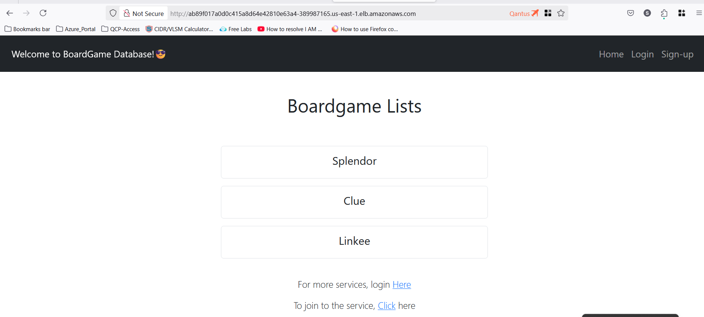

### <span style="color: orange;"> Setup ArgoCD </span>

- Run the following commands to verify the `Pods` and `services type` in `terraform EC2`

```sh
kubectl get pods -n argocd
```


```sh
kubectl get svc -n argocd
```


```sh
kubectl get pods -n prometheus
```
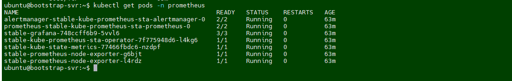

```sh
kubectl get service -n prometheus
```
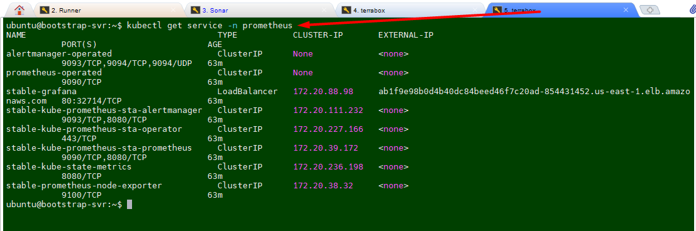

<!-- - Run these commands to change the service type from ```ClusterIP``` to ```LoadBalancer```.
```sh
kubectl patch svc stable-kube-prometheus-sta-prometheus -n prometheus -p '{"spec": {"type": "LoadBalancer"}}'
kubectl patch svc stable-grafana -n prometheus -p '{"spec": {"type": "LoadBalancer"}}'
kubectl patch svc argocd-server -n argocd -p '{"spec": {"type": "LoadBalancer"}}'
```
Verify status now.
 -->

- validate `ArgoCD` and `Grafana` access on browser.

#### <span style="color: orange;"> Access ArgoCD </span>
- run the following command to get URL of ArgoCD
```sh
ubuntu@bootstrap-svr:~$ kubectl get svc -n argocd
NAME                                      TYPE           CLUSTER-IP       EXTERNAL-IP                                                               PORT(S)                      AGE
argocd-applicationset-controller          ClusterIP      172.20.167.221   <none>                                                                    7000/TCP,8080/TCP            66m
argocd-dex-server                         ClusterIP      172.20.158.1     <none>                                                                    5556/TCP,5557/TCP,5558/TCP   66m
argocd-metrics                            ClusterIP      172.20.168.248   <none>                                                                    8082/TCP                     66m
argocd-notifications-controller-metrics   ClusterIP      172.20.67.200    <none>                                                                    9001/TCP                     66m
argocd-redis                              ClusterIP      172.20.2.127     <none>                                                                    6379/TCP                     66m
argocd-repo-server                        ClusterIP      172.20.162.115   <none>                                                                    8081/TCP,8084/TCP            66m
argocd-server                             LoadBalancer   172.20.184.179   a05d8113a21ea47e0ad6499f45767594-1028681490.us-east-1.elb.amazonaws.com   80:32509/TCP,443:32733/TCP   66m
argocd-server-metrics                     ClusterIP      172.20.152.24    <none>                                                                    8083/TCP                     66m
```


- To get the login credential for argocd.
```sh
tail -n 200 /var/log/cloud-init-output.log | grep "ArgoCD Initial Password"
```


- 
#### <span style="color: orange;"> Configure Application in ArgoCD </span>
Once you access the ArgoCD URL and create an application
 - **Application Name**: boardgame-app
 - **Project Name**: default
 - **Sync Policy**: Automatic (Select Prune Resources and SelfHeal)
 - **Repository URL**: https://github.com/mrbalraj007/GithubAction_DevOps_Projects.git
 - **Revison**: main
 - **Path**: . (where Kubernetes files reside)
 - **cluster URL**: Select default cluster
 - **Namespace**: default


- Try to change something in ```deployment.yml``` (i.e Replica to `2` from 5))

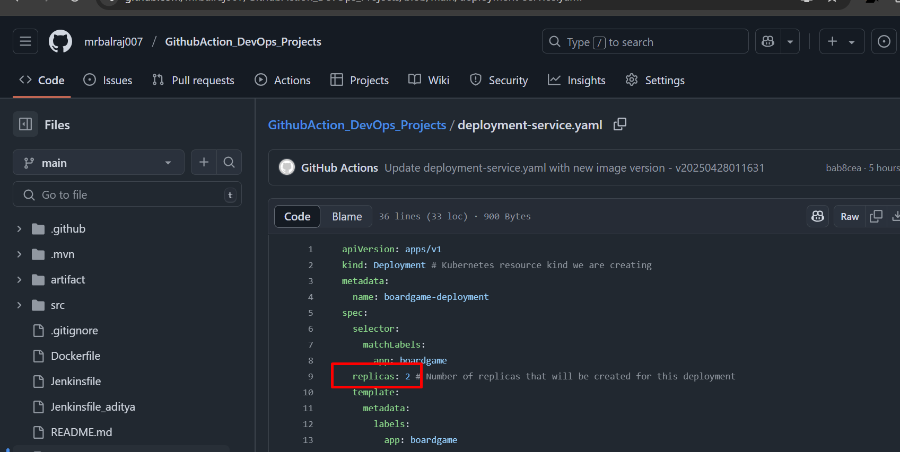

- **Verify the apps Status**
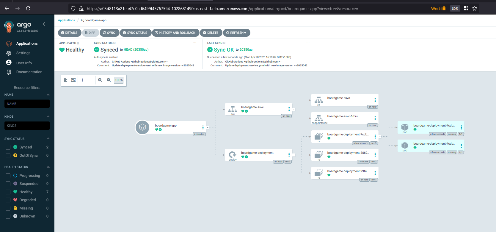

- **Verify Pods & service status**

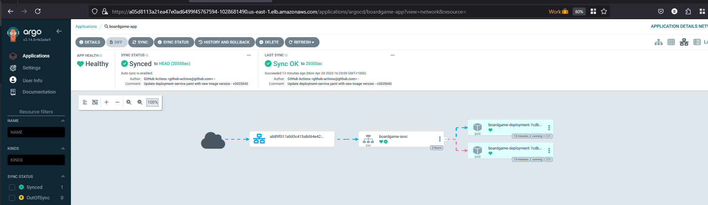

Click on the hostnames (URL details) from the service and access it in the browser.
```
ab89f017a0d0c415a8d64e42810e63a4-389987165.us-east-1.elb.amazonaws.com
```
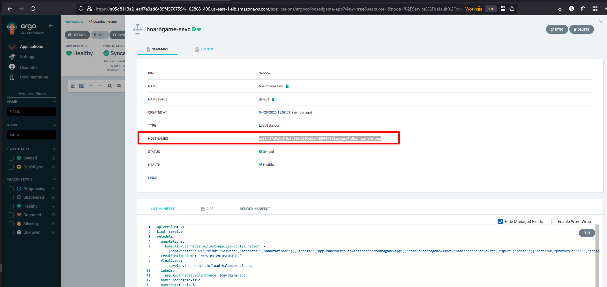

**Congratulations** :-) the application is working and accessible.
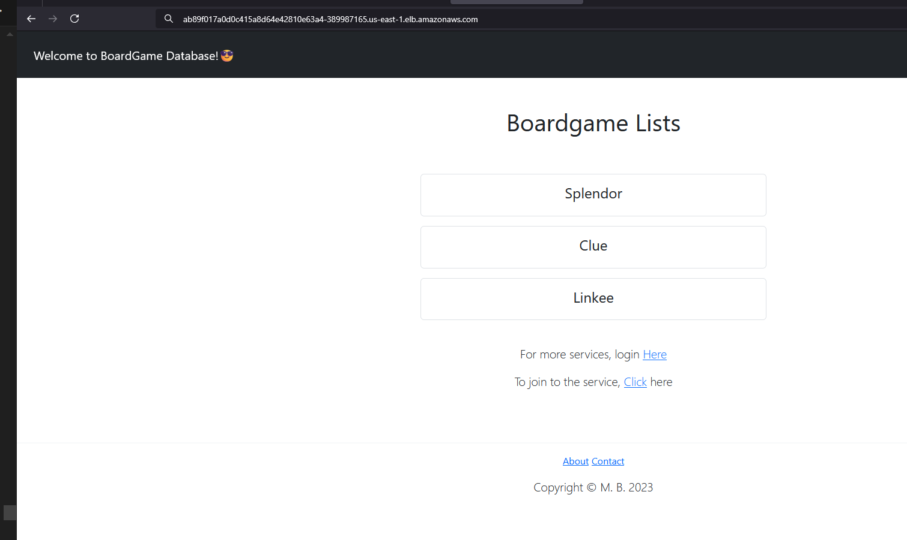

### <span style="color: orange;"> Setup Monitoring using Prometheus/Grafana  </span>
- Will run the following command to get a URL of Grafana
```bash
ubuntu@bootstrap-svr:~$ tail -n 200 /var/log/cloud-init-output.log | grep "You can access Grafana at: "
You can access Grafana at: http://ab1f9e98b0d4b40dc84beed46f7c20ad-854431452.us-east-1.elb.amazonaws.com
```


- Get Grafana 'admin' user password by running:
```bash
  kubectl --namespace prometheus get secrets stable-grafana -o jsonpath="{.data.admin-password}" | base64 -d ; echo
```


- Access Prometheus/Grafana and create a custom dashboard in Prometheus/Grafana.
  


Dashboard in Grafana


---

## <span style="color: Yellow;"> Environment Cleanup:
- Following resouces are created as part of this project.   
   

### <span style="color: cyan;"> To delete deployment:
- I've created a `Github Action` to destroy the Kubernetes `deployment` and `services`.
   

  - __Delete all deployment/Service__: 
    - In github action, and click on the second pipeline to delete the deployment and service.
    
    

    - Here is the complete [CICD- Pipeline to destroy Deployment and Services](https://github.com/mrbalraj007/Github-Actions-Project/blob/main/.github/workflows/Destroy.yaml)

### <span style="color: cyan;"> To delete ```AWS EKS cluster```
   -   Login into the `Terraform EC2 `instance and change the directory to /`k8s_setup_file`, and run the following command to delete the cluster.
       - ```sh
         sudo su - ubuntu
         cd /k8s_setup_file
         sudo terraform destroy --auto-approve
         ```
#### **Troubleshooting:** 
- I am getting below error message while running the `Terraform destroy`.
   


##### **Fix/Solution:**

- I noticed that permission is set to root for terraform dirctory. we have to take ownership first and then try to delete it.

- Run the following command to take ownership
   ```sh
   sudo chown -R ubuntu:ubuntu /home/ubuntu/k8s_setup_file/.terraform*
   ```
- I was still getting error message while runing the desrtoy
   
- I ran the following command again for entire terraform folder.
   ```sh
   sudo chown -R ubuntu:ubuntu /home/ubuntu/k8s_setup_file/terraform*
   ```
- Rerun the destroy command and this time it works :-)


###  <span style="color: cyan;"> To delete the ```Virtual machine```.
Go to folder *<span style="color: cyan;">"02.Github_Action_DevOps-Project/Terraform_Code_Infra_setup"</span>* and run the terraform command.
   - `00.Code_IAC-github-repo`
   - `01.Code_IAC_Selfhosted-Runner-and-Trivy`
   -` 02.Code_IAC_SonarQube`
   - `03.Code_IAC_Terraform_box`
      
      ```sh
      Terraform destroy --auto-approve
     ```
> 💡 **Note:** 
>> You must use this command from `each folder` in order to destroy the entire infrastructure.
---

### **Why Use This Project**
- **Automation**: Reduces manual effort in building, testing, and deploying applications.
- **Security**: Ensures code and container security through automated scans.
- **Scalability**: Deploys applications to scalable Kubernetes clusters.
- **Best Practices**: Demonstrates industry-standard CI/CD practices.

---

## Conclusion

This project demonstrates a comprehensive DevOps implementation that bridges the gap between development and operations through automation, monitoring, and security best practices. The pipeline not only streamlines the deployment process but also ensures quality and security at every step.

By implementing this solution, organizations can achieve:

1. **Increased Deployment Frequency**: Automation reduces the friction in deploying new code
2. **Improved Quality Assurance**: Integrated testing and scanning prevent defects
3. **Enhanced Operational Visibility**: Comprehensive monitoring provides insights
4. **Better Developer Experience**: Streamlined workflows with immediate feedback

The modular nature of the implementation allows organizations to adapt specific components to their needs while maintaining the overall workflow integrity. As container orchestration and cloud-native technologies continue to evolve, this pipeline architecture provides a solid foundation that can be extended to incorporate emerging tools and practices.


__Ref Link:__

- [Youtube VideoLink](https://www.youtube.com/watch?v=FTrTFOLbdm4)
- [Clearfile-content cache in visualstudio code](https://stackoverflow.com/questions/45216264/clear-file-content-cache-in-visual-studio-code)
- [Managing-GitHub-access-tokens](https://docs.github.com/en/authentication/keeping-your-account-and-data-secure/managing-your-personal-access-tokens)
- [GitHub Actions Markget Place](https://github.com/marketplace)
- [Download-a-build-artifact](https://github.com/marketplace/actions/download-a-build-artifact)
- [Upload-a-build-artifact](https://github.com/marketplace/actions/upload-a-build-artifact)
