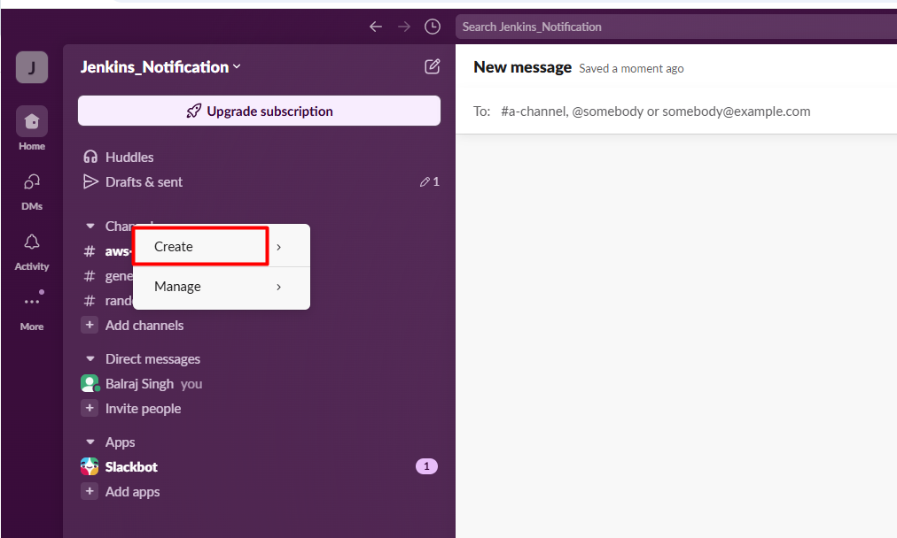
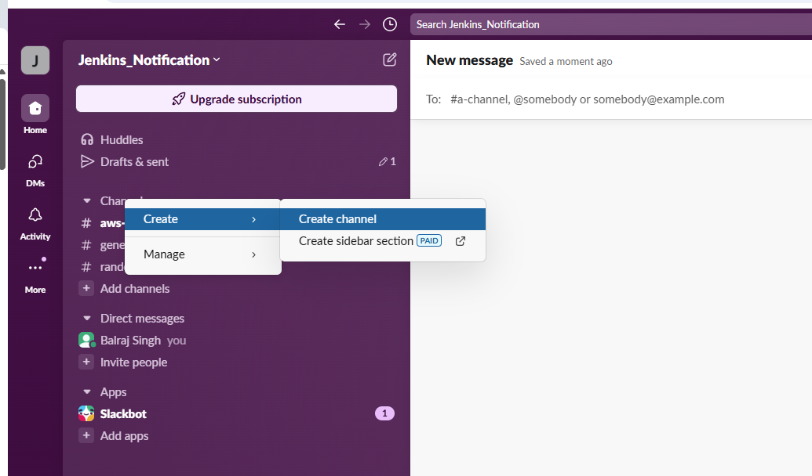
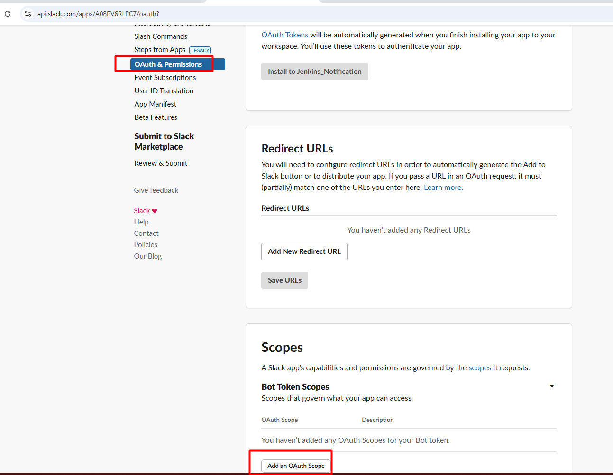
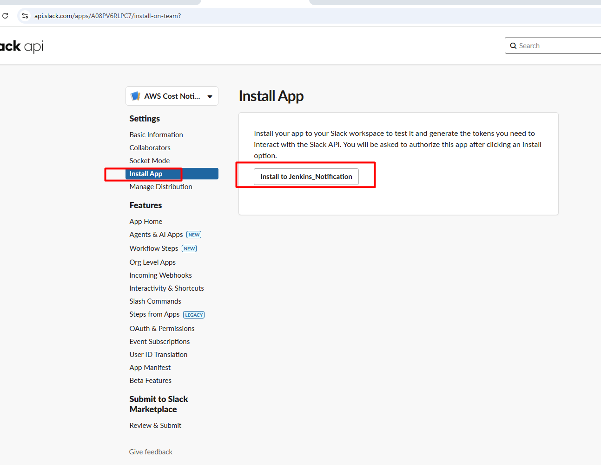
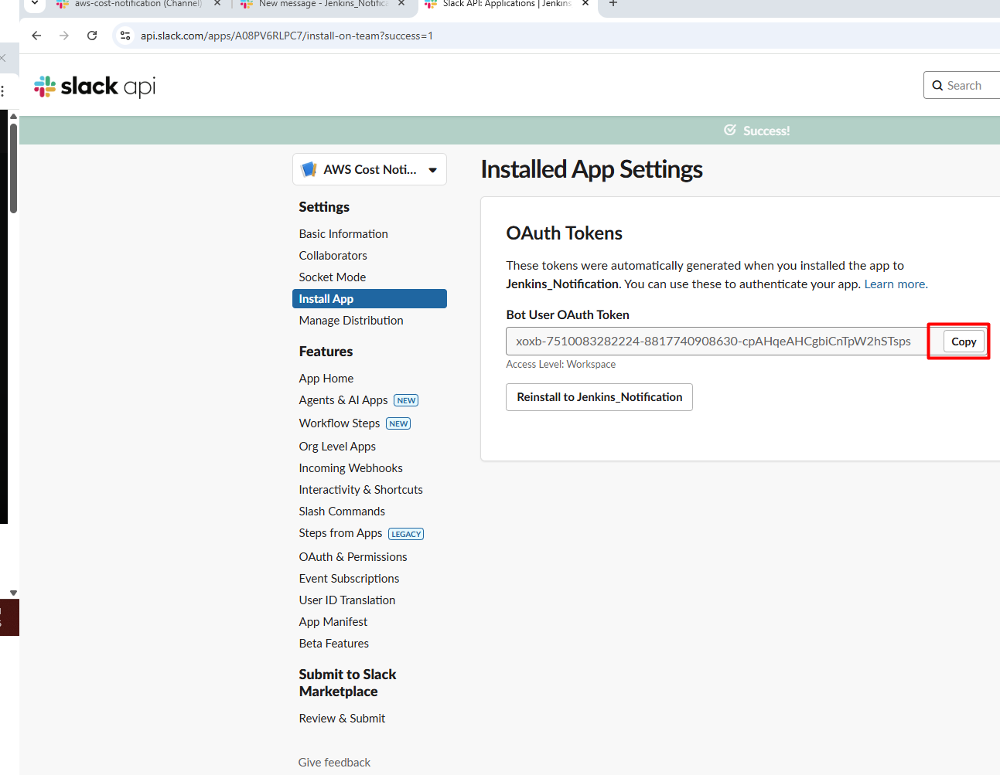
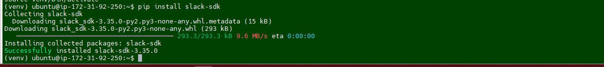
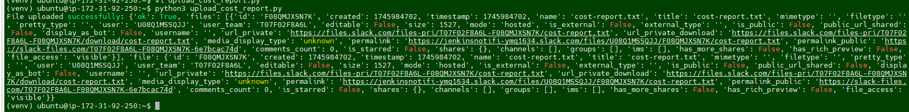
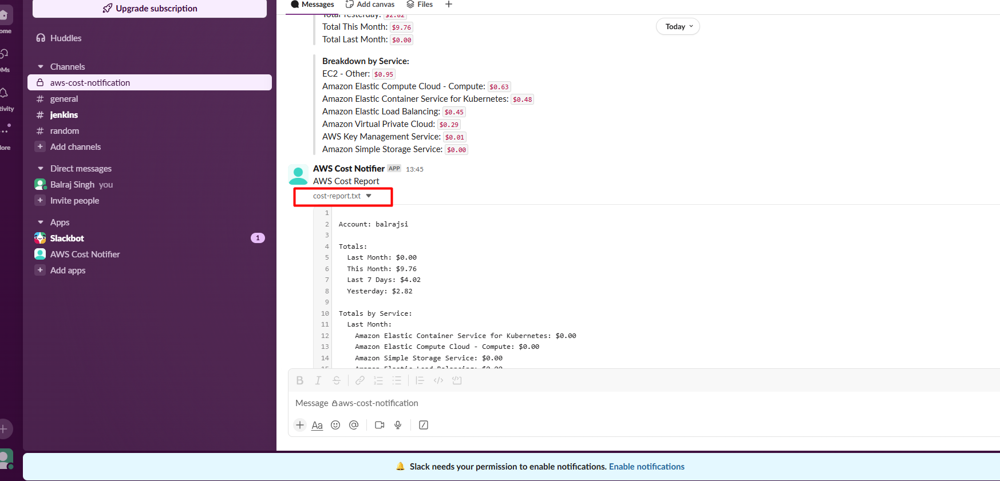

# AWS Cost Optimization with Automated Monitoring and Reporting

## Executive Summary
This document outlines a solution for AWS cost optimization through automated monitoring and reporting. By implementing this solution, organizations can gain regular insights into their AWS spending patterns, identify cost spikes, and take appropriate actions to optimize cloud expenses.

## Key Points
- **Measurement First Approach**: You cannot optimize what you cannot measure
- **Daily Cost Tracking**: Automated daily reports provide consistent visibility
- **Service-based Analysis**: Breakdown of costs by AWS service helps pinpoint expensive resources
- **Spike Detection**: Comparing daily costs helps identify unusual spending patterns
- **Automated Slack Notifications**: Reduces manual monitoring effort and ensures timely awareness

## Tools and Technologies

| Tool/Technology | Purpose |
|----------------|---------|
| AWS Cost CLA | Command-line application for retrieving cost data |
| NodeJS/npm | Required for installing AWS Cost CLA |
| AWS CLI | For authentication and access to AWS resources |
| Slack | Communication platform for receiving cost reports |
| Slack SDK (Python) | Used for uploading complete reports as files to Slack |
| Python | For creating the script to upload reports to Slack |
| Cron Jobs | For scheduling automated daily reporting |

## Implementation Steps

### 1. Setup Environment
- Create a virtual machine (or use existing server)
- Update system packages
- Install NodeJS using NVM
- Install AWS CLI

### 2. Install and Configure AWS Cost CLA
- Install AWS Cost CLA using npm
- Configure AWS credentials using `aws configure`
- Test basic cost reporting with command `aws-cost`

### 3. Create Slack Integration
- Create a dedicated Slack channel for cost reporting
- Create a new Slack application
- Configure the following permissions:
  - `chat:write`
  - `chat:write.public`
  - `files:write` (for file uploads)
- Install the app to your workspace and save the Bot token
- Copy the Slack channel ID

### 4. Create Python Script for Report Uploads
- Install Python and the Slack SDK
- Create a script (`upload_cost_report.py`) that:
  - Reads cost report data
  - Uploads it as a file to the Slack channel
  - Confirms successful upload

### 5. Set Up Automation
- Generate cost report files using AWS Cost CLA
- Execute the Python script to upload the report
- Configure cron job to run this process daily

## Challenges

1. **Limited Message Display**: Slack has message size limitations that prevent displaying the complete service breakdown directly in messages
   - Solution: Upload reports as files instead

2. **Permissions Configuration**: Setting up proper permissions for both AWS and Slack requires careful configuration
   - Solution: Follow step-by-step process for configuring OAuth scopes and AWS credentials

3. **Manual Analysis Required**: While the system automates reporting, analysis still requires human interpretation
   - Solution: Establish baselines and patterns to make anomaly detection easier

4. **Authentication Security**: Using root AWS credentials is not recommended for production
   - Solution: Create dedicated IAM users with read-only cost explorer permissions

## Benefits

1. **Proactive Cost Management**: Daily visibility into costs prevents end-of-month billing surprises
2. **Quick Issue Detection**: Identifying cost spikes within 24 hours allows for rapid response
3. **Service-Level Insights**: Understanding which services contribute most to costs enables targeted optimization
4. **Automated Workflow**: Reduces time spent manually checking cost dashboards
5. **Centralized Communication**: Cost reports delivered to Slack integrate with existing team communication channels

## Conclusion

AWS cost optimization requires consistent monitoring and analysis of spending patterns. This solution provides an automated approach to cost reporting that enables teams to quickly identify unusual spending patterns or resource utilization. By implementing daily cost reports delivered directly to Slack, organizations can foster a cost-conscious culture and respond rapidly to unexpected expenses.

The combination of AWS Cost CLA, Slack integration, and scheduled reporting creates a seamless system that reduces the manual effort required for cost monitoring while increasing visibility across the organization. This approach transforms cost optimization from a reactive, month-end activity into a proactive, daily practice that can significantly reduce cloud spending over time.


```sh
The script has been updated with several improvements to ensure the aws-cost command is available to the ubuntu user when you SSH in:

Added a symbolic link to make aws-cost available in the system path (/usr/local/bin/aws-cost)
Properly set up both .bashrc and .profile to include NVM configuration
Created a robust run-aws-cost.sh script in the ubuntu home directory
Added a system-wide aws-cost-run script in /usr/local/bin
With these changes, after the EC2 instance is provisioned, you should be able to:

SSH into the instance and run aws-cost directly (thanks to the symbolic link)
If that doesn't work, you can run `source ~/.bashrc && aws-cost`
Or simply use the helper script: ~/run-aws-cost.sh
As a last resort, use the system-wide script: aws-cost-run
````

https://slack.com/intl/en-au/





https://api.slack.com/apps










Invite the Bot in Slack Channel
/invite @AWS Cost Notifier and click on `send`


1️. Install Python & pip (if not already)
```bash
sudo apt update
sudo apt install -y python3 python3-pip python3-venv
```
2️. Create a Virtual Environment (Optional but Recommended)
```bash
python3 -m venv venv
source venv/bin/activate
```


1.
Install Slack SDK:
```sh
pip install slack-sdk
```



Create Python Script (upload_cost_report.py): from slack_sdk 
```py "upload_cost_report.py"
from slack_sdk import WebClient 
from slack_sdk.errors import SlackApiError
slack_token = "xxxxxxxxxxxxxxxxxxxxxxxxxxxx" 
client = WebClient(token=slack_token)

try: 
	# Use files_upload_v2 (latest method) 
	response = client.files_upload_v2( 
		channel="xxxxxxxxxxxxxxxxxxxxxxx", 
		initial_comment="AWS Cost Report",
		file="cost-report.txt" 
	) 
	print("File uploaded successfully:", response)

except SlackApiError as e: 
 print(f"Error uploading file: {e.response['error']}")
```
3. Run the AWS Cost CLI + Python Script:
# Generate cost report
```sh
aws-cost --text > cost-report.txt
```


# Upload to Slack
python3 upload_cost_report.py






Ref Link: 

https://www.youtube.com/watch?v=kBs59NlNxys&t=783s


https://nodejs.org/en/download

https://github.com/kamranahmedse/aws-cost-cli?tab=readme-ov-file
